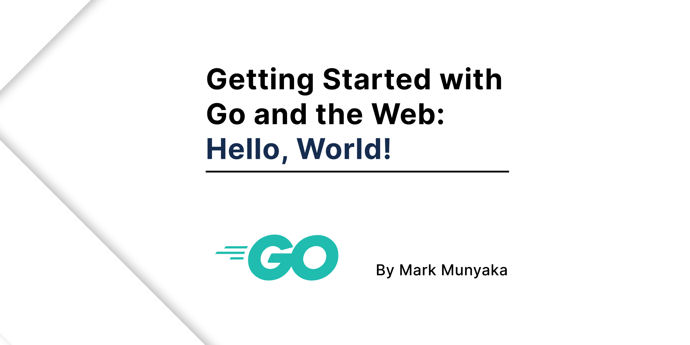
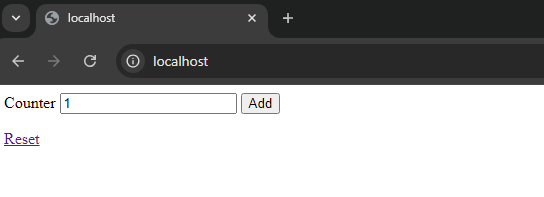

# Getting Started with Go and the Web: Hello World!



## Description

This repo contains the source code for a guide on Go. The guide aims to gently introduce Go and see how it can be used to build applications for the web. This tutorial is aimed towards beginners, however experienced devs can just look through as well.

Tutorial: https://dev.to/markmunyaka

## Before You Start

To test the project, you need to have Go installed on your machine. Download and install Go by following the instructions [Download and Install Go]()

## Getting Started

Clone the repository
```sh
git clone https://github.com/Marktawa/sturdy-train.git
```

Run the file
```sh
cd sturdy-train
```

```sh
go run main.go
```

Visit http://localhost in your browser



## Author

[Mark Munyaka](https://github.com/Marktawa)